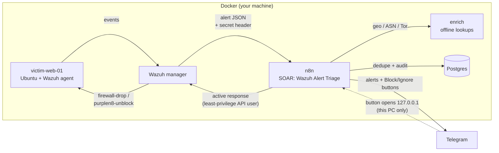
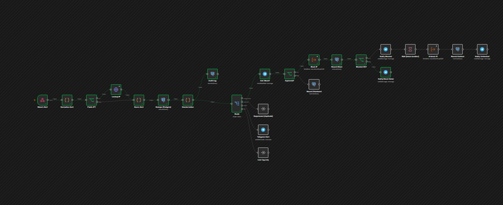
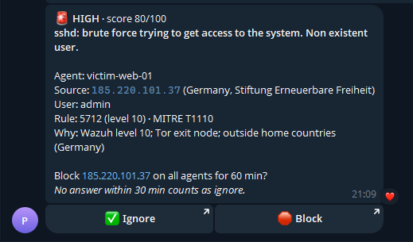
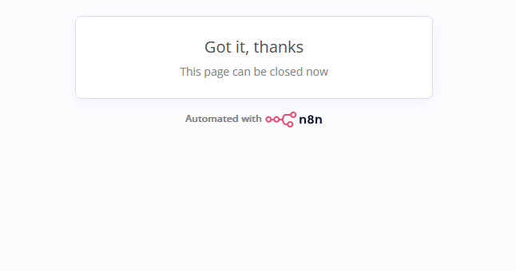
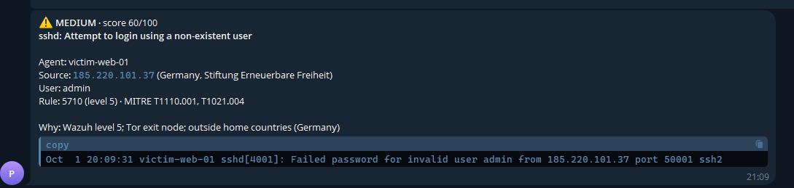
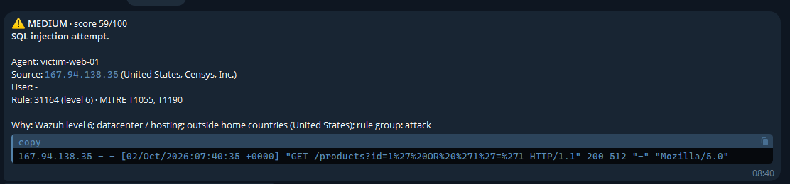
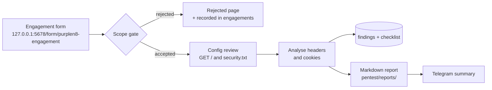
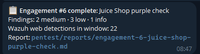

# PurpleN8

[](https://github.com/Mr8lu3/PurpleN8/actions/workflows/ci.yml)

**A local-first security automation lab built with n8n and Wazuh.**
Wazuh detects, n8n triages, an analyst approves a block from Telegram, and every alert and decision is written to a local audit log.

Everything runs on your own machine in Docker. There are no paid services, no cloud SIEM and no third-party lookup APIs: alert data stays local. The only outbound traffic is the Telegram notification you opt into, plus downloads of public threat-intel datasets.

It has two halves, for the blue and red sides of security work:

- **SOAR (blue):** Wazuh alert triage, scoring, deduplication and human-in-the-loop blocking.
- **Pentest engagement assistant (red):** an authorisation and scope gate, a non-intrusive configuration review, findings tracking, a manual-testing checklist and a Markdown report, run against your own lab.
- **The purple loop:** the lab web server's access log feeds Wazuh, so activity during an engagement reaches the SOAR side. The report shows which activity was **detected** and how it was handled.

It's backed by [unit, integration and CI tests](#testing) and a [threat model](docs/THREAT-MODEL.md) of the lab itself.

---

## What it does



<p align="center">
  <br>
  <sub>The triage workflow in n8n during a run where the analyst approved a block. Green nodes show the path the alert took.</sub>
</p>

For each Wazuh alert (level 5+):

1. **Normalise:** pull out rule, level, agent, source IP, user and MITRE ATT&CK IDs, whatever the log type.
2. **Enrich offline:** country, network owner, Tor exit node and hosting provider, looked up in local databases.
3. **Score:** 0-100 from the Wazuh level plus enrichment signals, giving `low`, `medium` or `high`.
4. **Deduplicate:** one notification per source and rule every 10 minutes, enforced atomically in Postgres.
5. **Audit:** every alert is written to `alert_log` with its score, reasons and outcome.
6. **Route:**
   - `high` with a public source IP: a Telegram message with **🛑 Block / ✅ Ignore** buttons.
     Block runs Wazuh's `firewall-drop` on **all agents**. The block is lifted automatically after `BLOCK_MINUTES`.
     No answer within 30 minutes counts as ignore. Every decision goes to `response_log`.
   - `medium`, or `high` without an IP: a silent Telegram notification.
   - `low`: logged only.

Example: a simulated SSH brute force from a Tor exit node raises 9 Wazuh alerts. This produces **one** medium notification and **one** high alert with buttons, and the rest are suppressed and logged.

<p align="center">
  
  &nbsp;
  <br>
  <sub>Left: a HIGH alert with enrichment, MITRE ATT&CK IDs and the reasons for its score. Right: the page that opens after tapping a button (served by the local n8n at 127.0.0.1).</sub>
</p>

<p align="center">
  <br>
  <br>
  <sub>MEDIUM alerts arrive as silent notifications, with the raw log line HTML-escaped.</sub>
</p>

## Pentest engagement assistant



- **Scope gate:** every target must be an http(s) URL on the lab allowlist (`PENTEST_ALLOWED_HOSTS`, default `juice-shop`). An authorisation reference and confirmation are required, and today must fall inside the authorised window. **Rejected requests are recorded too**, which gives an audit trail of what was refused and why.
- **Non-intrusive checks:** one ordinary GET of each target's home page and `/.well-known/security.txt`. Headers and cookies are compared with the [OWASP Secure Headers Project](https://owasp.org/www-project-secure-headers/) guidance: HTTPS, HSTS, CSP, clickjacking protection, `nosniff`, Referrer-Policy, Permissions-Policy, CORS, version disclosure, cookie flags and security.txt. **No attack payloads are sent.**
- **Severity** uses a simple qualitative rubric (info / low / medium / high). It is **not CVSS**.
- **Output:** rows in `findings`, a 10-item OWASP Top 10 (2021) manual-testing `checklist` per engagement, a Markdown report in `pentest/reports/` (git-ignored) and a Telegram summary.
- **Lab target:** [OWASP Juice Shop](https://owasp.org/www-project-juice-shop/), a deliberately vulnerable app, behind a small nginx proxy. It runs only when you ask for it (`--profile pentest`) and is bound to `127.0.0.1`.
- **Detection (purple team):** the proxy writes a standard access log that the victim's Wazuh agent monitors. Each report includes the Wazuh web alerts (31xxx rules) raised during the authorised window, grouped by rule and source, with the SOAR outcome for each. Anything you tested that is missing from that list is a detection gap.

Example run against Juice Shop: 2 medium (no HTTPS, no CSP), 2 low (no Referrer-Policy, `Access-Control-Allow-Origin: *`) and 1 info (only the deprecated Feature-Policy is set). It passes X-Frame-Options, `nosniff` and security.txt.

<p align="center">
  
</p>

```bash
docker compose --profile pentest up -d juice-shop
# open http://127.0.0.1:5678/form/purplen8-engagement, target http://juice-shop:3000
docker exec -it purplen8-postgres psql -U purplen8 -d purplen8 -c "select severity, title from findings order by id desc limit 10;"
./soar/scripts/simulate-web-alert.sh   # replay the sample web-attack log line; it appears in the next report's Detection section
```

The workflow only reads and writes files in `pentest/reports/` (`N8N_RESTRICT_FILE_ACCESS_TO`).

## Privacy and security design

| Control | Why |
|---|---|
| Offline IP enrichment (`enrich/`) | Attacker IPs are never sent to third-party lookup APIs. It uses DB-IP Lite databases and the Tor exit list, refreshed on a schedule. |
| Ports bound to `127.0.0.1` only | n8n is not reachable from your LAN. Postgres, Wazuh and enrich publish no ports at all. |
| Shared secret on the alert webhook | n8n rejects alerts without the `X-PurpleN8-Token` header (403), so nobody else can inject fake alerts. |
| Wazuh factory password replaced | `setup.sh` changes the default `wazuh:wazuh` API admin password. |
| Least-privilege API user | n8n's Wazuh user can **only** run active responses: it can't read agents, rules or users. |
| Allowlisted response commands | The response sub-workflow only accepts `!firewall-drop` and `!purplen8-unblock`, with strict IPv4 validation. It's checked again on the agent before iptables runs. |
| Human-in-the-loop blocking | Blocks need an analyst's approval and expire automatically. This avoids locking out legitimate users through false positives or spoofed IPs. |
| Secrets in a git-ignored `.env` | Credentials are created in n8n from `.env` by `setup.sh` and are never committed. |
| Append-only audit tables | `alert_log` and `response_log` record what happened and why, for incident review. |
| Pentest scope gate | Testing only runs against allowlisted lab hosts, with an authorisation reference, inside the authorised dates. Refused requests are recorded. |
| Narrow file access | n8n may only read and write files in `pentest/reports/`. |

### Trade-offs, stated honestly
- **Telegram is the one external service.** Notifications leave your machine through Telegram's servers. The approval buttons, though, link back to `127.0.0.1`, so Telegram never has access to n8n.
- **TLS verification is off** for n8n to Wazuh API calls, because Wazuh uses a self-signed certificate. The traffic stays on the internal Docker network.
- **Hosting detection is a heuristic** (known provider network numbers plus name keywords), not a full proxy/VPN database.
- **Dedupe happens before notification:** if Telegram is down, that alert is not re-sent within the 10-minute window. It is still in `alert_log`.
- The lab Wazuh manager runs **without the indexer or dashboard** to keep RAM low. Alerts are still in `alerts.json` and in the n8n audit log. Wazuh's vulnerability detection is **disabled**: it needs the indexer, and left on it downloads about 40 GB of CVE feeds.
- **No retry between Wazuh and n8n:** alerts sent while n8n is restarting are dropped (they stay in Wazuh's `alerts.json`). See the [threat model](docs/THREAT-MODEL.md).

## Quick start

**Requirements:** Docker (Docker Desktop with WSL2 works), about 1 GB free RAM, a Telegram bot from [@BotFather](https://t.me/BotFather) and your chat ID from [@userinfobot](https://t.me/userinfobot).

```bash
git clone <this repo> && cd PurpleN8
cp .env.example .env          # set TELEGRAM_BOT_TOKEN and TELEGRAM_CHAT_ID
./setup.sh                    # builds, hardens, installs, imports; safe to re-run
```

Then open **http://127.0.0.1:5678** and create your local n8n owner account.

In your bot chat, press **Start** once, so the bot is allowed to message you.

### Try it

```bash
./soar/scripts/send-sample.sh                 # 4 sample alerts (SSH brute force, SQLi, Windows logon, file change)
./soar/scripts/simulate-ssh-bruteforce.sh     # real Wazuh alerts: writes failed SSH logins on the victim
```

Tap **🛑 Block** in **Telegram Desktop on the same PC**. Then check the victim's firewall:

```bash
docker exec purplen8-victim iptables -S | grep DROP
```

Query the audit trail:

```bash
docker exec -it purplen8-postgres psql -U purplen8 -d purplen8 \
  -c "select received_at, srcip, rule_id, score, severity, action from alert_log order by id desc limit 10;" \
  -c "select at, srcip, action, detail from response_log order by id desc limit 10;"
```

## Testing

| Layer | What it checks | Where it runs |
|---|---|---|
| **Unit tests** (`tests/unit/`, 20 tests) | The actual JavaScript from the n8n workflow files, run with mocked inputs: alert normalisation, scoring, escaping, decisions, the response command allowlist, the pentest scope gate and the header analysis | CI and locally: `node --test tests/unit/*.test.mjs` |
| **Static checks** (`tests/static.sh`) | Script syntax, `shellcheck`, workflow integrity (every connection and credential exists), a secret scan, and `docker compose` validation | CI and locally |
| **Integration tests** (`tests/integration.sh`, 23 checks) | Against the running stack, using a *dry-run* flag so nothing is notified or blocked: webhook auth, every sample's severity, private-IP handling, dedupe (including 10 simultaneous alerts), offline enrichment, Wazuh API hardening, port exposure and the pentest scope gate | Locally, after `./setup.sh` |

The unit tests read the code straight out of the exported workflows, so they always test what actually ships. Changing one scoring weight or loosening the IP check makes them fail.

## Scoring

| Signal | Points |
|---|---|
| Wazuh rule level (0-15) | level × 4 |
| Tor exit node | +30 |
| Hosting / cloud provider | +15 |
| Outside `HOME_COUNTRIES` | +10 |
| Wazuh rule group `attack` | +10 |

Scores are capped at 100. **High** is 70 or more, **medium** is 40 or more, and anything lower is **low**. The rules are plain JavaScript in the *Score Alert* node, so you can tune them there.

## Repository layout

```
docker-compose.yml          n8n, Wazuh manager, Postgres, enrich, victim, juice-shop (profile)
setup.sh                    one-shot, re-runnable setup
.env.example                configuration template (copy to .env)
db/init.sql                 alert_log, dedupe_window, response_log, engagements, findings, checklist
enrich/                     offline IP enrichment service (Python, no published ports)
victim/                     lab server: Ubuntu + Wazuh agent + iptables + unblock script
soar/workflows/             n8n workflows (triage + active-response sub-workflow)
soar/wazuh-integration/     Wazuh -> n8n integration, installer, API hardening
soar/samples/               sample Wazuh alerts
soar/scripts/               sample sender, SSH brute-force and web-log simulators
pentest/workflows/          n8n engagement assistant workflow
pentest/proxy/              nginx config for the logging proxy in front of Juice Shop
tests/                      unit tests, static checks, integration tests
docs/                       threat model, screenshots
.github/workflows/          CI
pentest/reports/            generated reports (git-ignored)
```

## Resource use (measured)

| Container | RAM |
|---|---|
| n8n | ~400 MB |
| Wazuh manager | ~360 MB |
| victim (Wazuh agent) | ~35 MB |
| Postgres | ~30 MB |
| enrich | ~20 MB |
| Juice Shop + proxy (only with `--profile pentest`) | ~160 MB |

## Ethics

This is a **lab**. The brute-force simulator only writes log lines inside the victim container, and nothing is attacked. The engagement assistant sends only ordinary GET requests, and only to allowlisted lab hosts. Use PurpleN8 only on systems you own or are authorised to test and manage.

## Credits

- [n8n](https://n8n.io) (Sustainable Use License) and [Wazuh](https://wazuh.com) (GPLv2)
- IP geolocation and ASN data: [DB-IP](https://db-ip.com) Lite databases, licensed under [CC BY 4.0](https://creativecommons.org/licenses/by/4.0/)
- Tor exit list: [The Tor Project](https://check.torproject.org/torbulkexitlist)
- Lab target: [OWASP Juice Shop](https://owasp.org/www-project-juice-shop/) (MIT)
